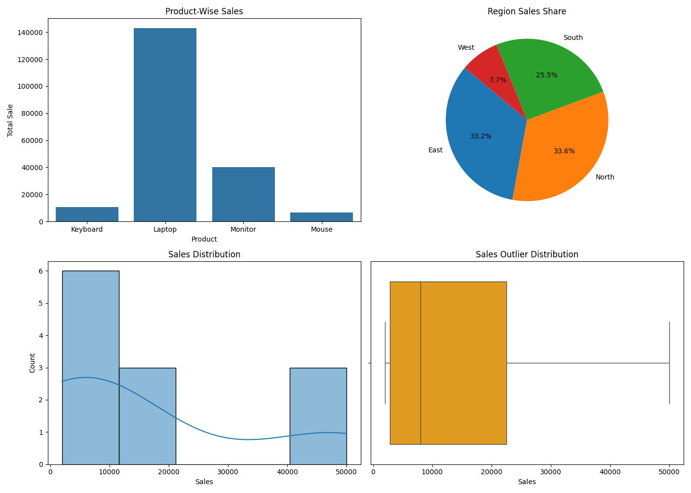

# Retail Sales Analytics Dashboard

## Overview
Retail sales data analysis using Python, Pandas, Matplotlib and Seaborn.

## Features
- Product-wise Sales Analysis
- Region-wise Sales Analysis
- Sales Distribution Analysis
- Outlier Detection
- Quantity Analysis
- CSV Summary Report
- Dashboard Visualization

## Technologies Used
- Python
- Pandas
- NumPy
- Matplotlib
- Seaborn

## Output Files
- retail_dashboard.png
- sales_summary.csv

## Dashboard Preview

## Author
Vansh Shah
